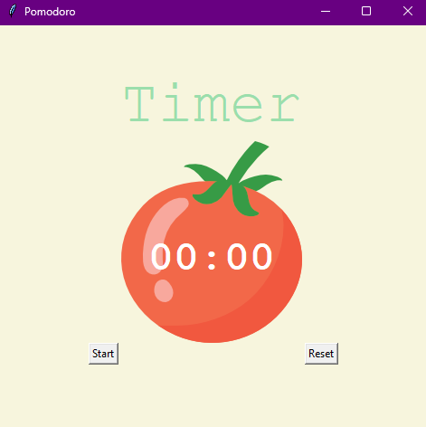
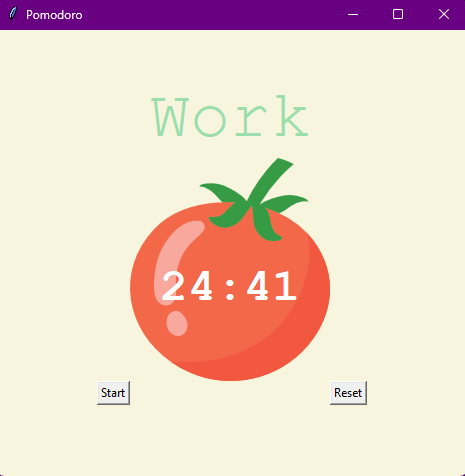

# Pomodoro Timer
## Overview
Hello, everyone! I'm Mert, and today is Day 28 of my "100 Days of Python" challenge. In this project, I've created a Pomodoro Timer using the Tkinter library.




## Project Description
The Pomodoro Timer allows users to follow the Pomodoro Technique conveniently. It features work sessions, short breaks, and long breaks, with visual and auditory cues to help users stay on track. The graphical user interface is designed to be simple and user-friendly.

## Pomodoro Technique
The Pomodoro Technique, developed by Francesco Cirillo, encourages working in short, focused bursts, known as "Pomodoros," typically lasting 25 minutes. After each Pomodoro, take a short break (5 minutes), and after completing a set of Pomodoros, take a longer break (15-30 minutes). This technique aims to enhance concentration, creativity, and efficiency.

## How to Run
To use the Pomodoro Timer, follow these steps:



* Run the Python script:
   ```bash
   python main.py
   ```

* Click the "Start" button to begin the Pomodoro session.

* Click the "Reset" button to cancel the current session and start fresh.

Make sure you have Python installed on your system.

## Project Files
* main.py: The main Python script for the Pomodoro Timer.
## Getting Started
* Run the script and click "Start" to initiate a Pomodoro session.
* Observe the timer countdown and take breaks accordingly.
## Educational Insights
This project provides hands-on experience with key Python concepts:

* Tkinter GUI: Creating a graphical user interface for easy interaction.
* Timer Mechanism: Implementing a timer for tracking work and break intervals.
* Function Implementation: Defining functions to handle specific tasks.
* Sound Setup: Incorporating sound effects to signal the end of a work session.
## Conclusion
I hope you find the Pomodoro Timer helpful for boosting productivity! It's been a great journey reaching Day 28, and I'm excited to continue exploring and learning. Embrace the Pomodoro Technique, and happy coding!
